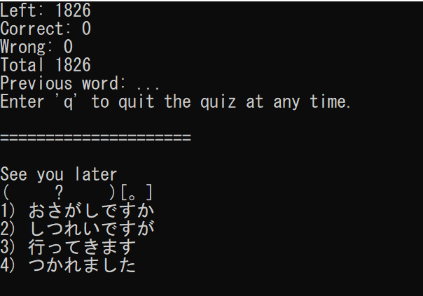
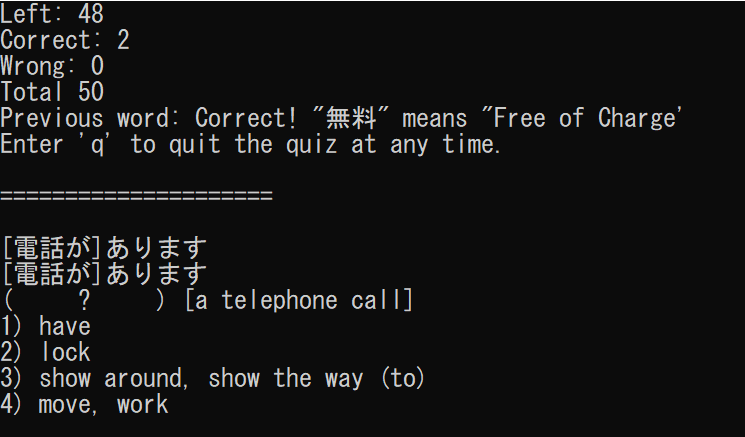
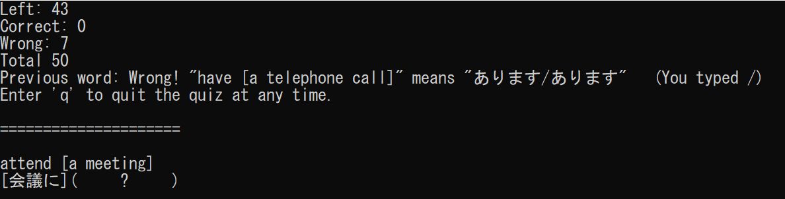

# Oboeru
*Python CLI Japanese Language MCQ Quiz* 

Oboeru (The romanization of the Japanese 覚える, which means ‘to remember’) is a program to help Japanese language learning, particularly NUS Japanese Language students using the みんなの日本語 textbook, to practice their vocabulary, especially after a hiatus of language studies.

## Features

- Vocabulary according to みんなの日本語
- Similar part of speech will be suggested as other options in MCQ.
- Vocabulary with clauses are handled, especially useful for open-ended quizes.

**MCQ (Japanese to English)**

**MCQ (English to Japanese)**

**Open Ended Quiz (Japanese to English)**

### Possible Future Features

- Open-ended quiz asking for different forms of words in terms of positive, negative, past, present, imperative, volitional.
- Testing particle usage of verbs.  

## How to Install
This project was developed with `Python 3.7.4`. Please ensure a compatible version is installed in your computer.

This project is developed on Windows. I am not sure whether this is compatible with other operating systems.

I have yet to make a `requirements.txt`, but this project uses 

- `pandas` to load the vocabulary excel file into the program. 
- `kakasi` to convert user input into hiragana in order to help check open-ended answers.

Therefore, `pip install panda`, `pip install kakasi` should do fine.

Ensure that the font used in the console can print asian fonts, such as MS Gothic, MS Mincho or NSimSun. You can change this via **Properties > Font > Font**

Download or clone the repo 

Open your command line inside `/project` folder 

Run the program by typing the command `python main.py`

## How to Use
Type any of the options to start a quiz. Enter the desired options when prompted. While in a quiz, answer 'q' to quit the quiz.

## How to add Vocabulary
To update the vocabulary, simply open and edit `vocab.xlsx`

### Fields
The excel file was originally made by me for Japanese 3 revision, hence not all fields are used in the current version of the application. It would be best however to fill up all fields when adding vocabulary as future functionality may use these.

⊛ indicates a required field for the current version of the program.

- ⊛ **lesson:** The corresponding lesson of the vocab as found in Minna no Nihongo. For the current version of the program, ensure that the lesson numbers are not discontinuous. (i.e. The current lesson numbers are from 1 to 31. Do not add a lesson number 50 or 43 etc.)

- ⊛ **pos:** The part of speech of the word. The current options are 'n', 'v', 'な-adj', 'い-adj', 'adverb', 'exp' (expression) and ' '. You can leave it blank, and it will be suggested as similar words to other words that have their part of speech undefined.

- **verbGroup:** The Verb group of the word. Use \*2 to indicate a special Group 2 verb. 

- **intransitive:** i for intransitive, t for transitive verbs

- **hasKatakanaOrKanji:** J if the **Japanese** field contains Kanji, K if it contains Katakana

- **preJapanese:** Any clause or symbol (eg: ～, ー) that appears before the Japanese word

- **preJapaneseParticle:** The particle of the clause that appears before the Japanese word

- ⊛ **japanese:** The Japanese word

- **postJapanese:** Any clause or symbol that appears after the Japanese word. Typically the '。' for expression will be put here. 

- **preEnglish:** Any clause that appears before the English word

- ⊛ **english:** The English word

- **postEnglish:** Any clause that appears after the English word

- **isSuruVerb:** Fill with either [を]する or をする or none depending on whether the word (which is likely a noun) can be used with する and in what usage.

- **suruMeaning:** The meaning of the word when added with する 

**Examples for language related columns:**

| Original | preJapanese |preJapaneseParticle | Japanese | postJapanese | preEnglish | english | postEnglish |
| --------:|------------:| -----:|-----: |-----:|-----:|-----:|-----:|
| うれます　[パンが～]  [bread] sell, be sold | パン | が | うれます | | bread | sell, be sold | 
| かようます　[大学に] go to and from [university] | 大学　| に | かようます | | | go to and from | university |　 
| [ああ、]よかった。  [Oh,] that's great!| ああ、| | よかった  |。 | Oh, | that's great! | |　 

If you have added entries to the excel sheet. Feel free to share it under Issues or email me at neilbrian.nl@gmail.com 

## How to Contribute
If you would like to work on this project. Do fork and PR any changes. It'll be amazing if you're a 日本語 学生 as well.

## FAQ

**Why not use Anki or [insert App name here]?**

_I get asked and probably will get asked this a lot._ 

- Oboeru fills up the other MCQ options with words of similar parts of speech. 
- Creating over 1800 Anki cards (or any quiz question on [_insert app name here_]) is tedious. 
- There is much more flexibility allowing more advanced quiz features to be potentially made.
- I decided to do this as a fun project before my last semester starts.
